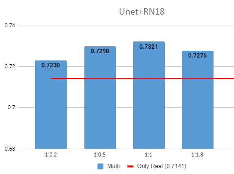
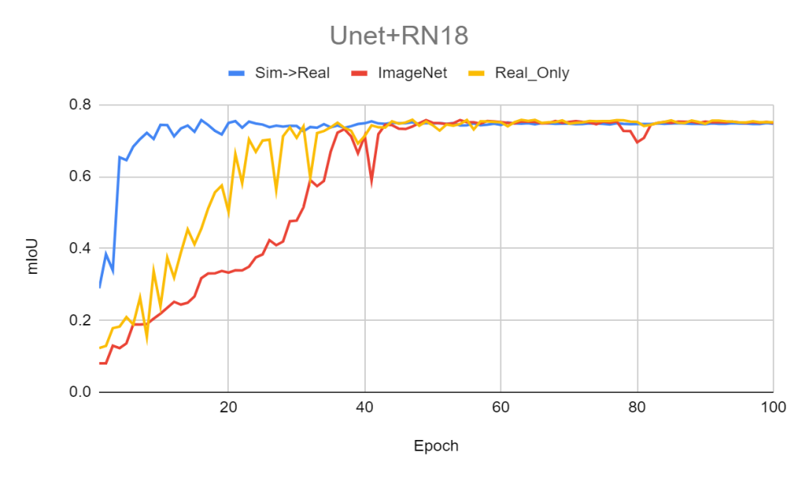
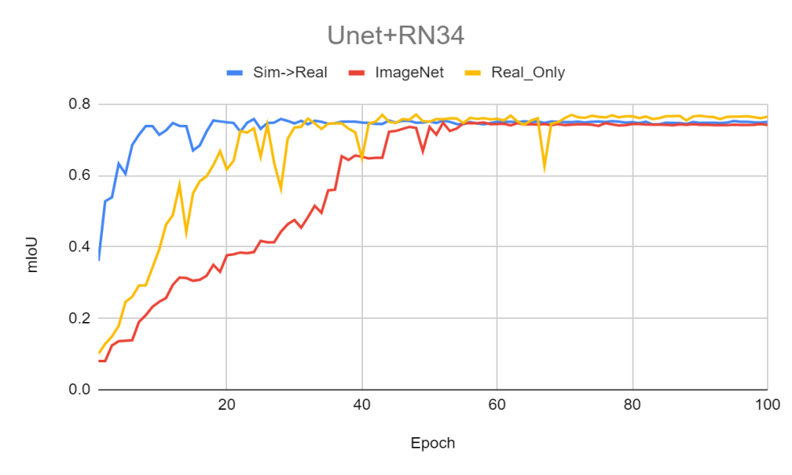
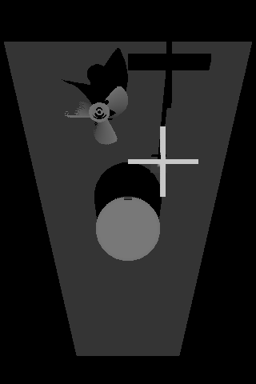

# 시뮬레이터를 이용한 수중 Multibeam Sonar Semantic segmentation
## 1. 과제 개요
### 가. 과제 선정 배경 및 필요성
바닷속은 아직 미지의 영역이며 변수가 많은 위험한 공간이다. 수압과 호흡의 문제 때문에 깊은 바다는 사람이 직접 잠수하여 접근하기 힘들다. 또 물속에서는 빛이 잘 전달되지 않아 무인잠수정(UUV)을 투입하여 깊은 곳으로 가더라도 지상에서처럼 카메라를 이용해 물체를 구분하기 어렵다. 이런 상황에서 사람이 직접 가기 힘든 곳에 무인잠수정을 투입하고 무인잠수정의 멀티빔 소나에서 수집하여 변환한 이미지로 수중 물체 탐지를 하면 더 안전하고 효과적으로 물체 탐지가 가능할 것으로 생각된다. 또한, 이를 활용하여 더 효율적인 인명 구조와 심해 탐사, 해양 쓰레기 탐지도 가능하리라 생각한다.

수중 환경은 접근이 힘들고 통제하기 어렵다. 특히 바다는 매우 넓고 깊으며 지형이 다양하며 다른 변수가 많으므로 통제하기 더 어렵다. 수중 환경을 탐색할 수 있는 무인잠수정과 소나의 가격도 비싸다. 그러므로 실제 바닷속에서 데이터를 얻는 것은 상당한 비용이 든다. 이런 상황에서 수중에서 소나를 이용해 얻은 데이터는 지상에서 카메라를 이용해 얻은 데이터에 비하면 데이터의 양과 질이 현저히 떨어진다. 따라서 시뮬레이터를 이용해 데이터를 수집하여 이를 보충한다면 데이터 수집 비용이 상당히 줄어들고 Semantic segmentation 모델의 성능 향상도 이루어질 것이라 기대된다.
### 나. 과제 주요내용
실제로 수중에서 얻은 데이터를 이용해 Semantic segmentation 모델을 학습하고 Multibeam 소나 시뮬레이터에서 얻은 데이터를 추가하여 모델을 학습하여 정확도를 비교한다. 시뮬레이터에서 데이터를 수집할 때 시뮬레이터 상에서의 물체의 위치와 상태를 바꾸어가면서 mask와 label(ground-truth)을 함께 얻도록 하여 별도의 annotation 작업이 필요 없도록 해 데이터 수집 비용을 줄일 수 있도록 한다. 이후 시뮬레이터에서 얻은 데이터와 실제 데이터를 이용해 Semantic segmentation의 정확도를 높일 방법을 찾는다.

## 2. 추진현황
### [가. Semantic segmentation 모델 구현](https://github.com/sundongpark/sonar_segmentation)
Semantic segmentation은 PyTorch를 이용해 구현한다. 선행연구(Singh, D., & Valdenegro-Toro, M. (2021).)에서 가장 성능이 좋았던 Unet+ResNet34 모델을 포함하여 Unet, Unet+ResNet(18, 34, 50, 101, 152), Unet+VGG(16, 19) 모델을 구축하였다. 이후 더 정확한 결과를 얻기 위해 구현한 모델에 가중치를 고정하여 학습을 진행해 mIoU 결과를 다시 얻었다.
### 나. 시뮬레이터 Sonar 이미지 조정
ARIS Explorer 3000 소나에서 수집된 데이터셋과 비슷한 이미지를 얻을 수 있도록 조정하였다. FOV와 주파수를 조정하여 ARIS Explorer 3000 소나와 비슷한 이미지를 얻을 수 있도록 조정하였다.
### 다. 시뮬레이터 Sonar 마스크 수집
Gazebo 시뮬레이터 상에서 바닥과 1~5개의 물체를 생성하여 소나 이미지를 얻는다. 이후 바닥을 제거하고 물체 하나씩만을 남겨 각각의 물체마다 투영된 이미지를 얻는다. 이때 노이즈를 제거하기 위해 물체마다 10장의 이미지를 수집한 뒤 평균을 구하고 일정 Threshold 이상의 값을 모두 Class의 ID로 칠하였다. 또 물체가 겹치는 부분과 그림자에 의해 가려지는 부분을 구분하기 위해 모든 물체가 있을 때 투영된 이미지와 비교하여 겹치는 부분만 남겨 마스크를 생성하였다. 이 과정을 반복하여 무한히 이미지와 마스크를 시뮬레이터에서 수집할 수 있다.

### 라. 시뮬레이터 소나 이미지 추가 후 Semantic segmentation 모델 성능 평가
시뮬레이터에서 얻은 Multibeam 소나 이미지를 기존 데이터셋(Marine Debris Datasets)에 0.2, 0.5, 1, 1.8배의 비율로 추가하여 성능을 평가하였다. 또 시뮬레이터에서 얻은 이미지만으로 학습한 이후 기존 데이터셋만을 사용하여 학습할 때, pre-trained 없이 학습할 때와 ImageNet pre-trained 모델을 사용할 때의 학습 속도를 비교하였다.

### 마. Depth camera를 이용해 소나 이미지 수집
ARIS Explorer 3000 소나와 비슷하게 Gazebo의 depth camera의 FOV를 조정하여 얻은 point cloud 정보를 이용해 ARIS Explorer 3000 소나와 비슷한 이미지를 얻도록 좌표 변환을 하여 이미지를 수집하였다.

## 3. 수행 결과
### 가. 과제 수행 결과
구축한 Unet, Unet+ResNet(18, 34, 50, 101, 152), Unet+VGG(16, 19) 모델의 가중치를 고정하여 학습을 진행해 mIoU 결과를 다시 얻은 결과는 다음과 같다.
| |Unet|Unet+RN18|Unet+RN34|Unet+RN50|Unet+RN101|Unet+RN152|Unet+VGG16|Unet+VGG19|
|:---:|:---:|:---:|:---:|:---:|:---:|:---:|:---:|:---:|
|mIoU|0.7448|0.7141|0.7291|0.7137|0.7219|0.6879|0.7181|0.7091| 

ARIS Explorer 3000 소나와 비슷하게 FOV와 주파수를 조정한 후 Gazebo 시뮬레이터 상에서 바닥과 1~5개의 물체를 생성하여 소나 이미지를 얻고 바닥을 제거하고 물체 하나씩만을 남겨 각각의 물체마다 투영된 이미지를 얻는 과정을 반복하여 수집한 이미지와 마스크는 다음과 같다.

시뮬레이터에서 얻은 Multibeam 소나 이미지를 기존 데이터셋(Marine Debris Datasets)에 0.2, 0.5, 1, 1.8배의 비율로 추가하여 성능을 평가하였다. 시뮬레이터에서 생성한 이미지를 학습에 사용했을 때 성능이 올라가는 경우가 존재했다.
|Real:Sim|Unet|Unet+RN18|Unet+RN34|Unet+RN50|Unet+RN101|Unet+RN152|Unet+VGG16|Unet+VGG19|
|:---:|:---:|:---:|:---:|:---:|:---:|:---:|:---:|:---:|
|1:0.2|0.7481|0.7230|0.7081|0.6911|0.7183|0.7124|0.7321|0.7142| 
|1:0.5|0.7359|0.7298|0.7352|0.7250|0.7163|0.7275|0.7353|0.7319| 
|1:1|0.7429|0.7321|0.7358|0.7241|0.7389|0.7286|0.7381|0.7311| 
|1:1.8|0.7453|0.7276|0.7459|0.7320|0.7415|0.7456|0.7300|0.7367|

시뮬레이터에서 얻은 Multibeam 소나 이미지만으로 학습한 이후 기존 데이터셋만을 사용하여 학습할 때 pre-trained 없이 학습하거나 ImageNet pre-trained 모델을 사용할 때보다 학습 속도가 더 빠른 것을 확인하였다.

ARIS Explorer 3000 소나와 비슷하게 depth camera의 FOV를 조정한 후 얻은 point cloud 정보를 이용해 좌표 변환으로 수집한 이미지는 다음과 같다.

### 나. 최종결과물 주요특징 및 설명
시뮬레이터를 이용하여 별도의 annotation 없이 데이터를 무한히 얻을 수 있다. 시뮬레이터를 통해 얻은 데이터를 추가한 모델은 그렇지 않은 모델보다 mIoU 값이 올라가는 상황이 존재했다. 또한 시뮬레이터에서 얻은 이미지로 학습한 pre-trained 모델이 기존 데이터셋만을 사용하여 학습할 때 pre-trained 없이 학습하거나 ImageNet pre-trained 모델을 사용할 때보다 더 효과적이었다. Depth camera를 이용해 소나 이미지를 얻도록 하여 BlueView P900 소나를 기반으로 구현된 시뮬레이터보다 더 ARIS Explorer 3000 소나에 가깝게 구현되었다.

## 4. 기대효과 및 활용방안
### 가. 기대효과
깊은 바다는 여러 가지 변수가 많기 때문에 접근이 힘들고 통제하기 어렵다. 또 수중 환경을 탐색할 수 있는 로봇과 전방감시소나의 가격이 비싸기 때문에 실제로 바닷속에서 수중 물체 탐지를 위한 데이터를 얻는 데에는 상당한 비용이 든다. 그렇기 때문에 바닷속에서 실제 데이터를 수집하기 전에 시뮬레이터를 이용해 데이터를 수집하고 모델을 학습한다면 데이터 수집 비용이 상당히 줄어들고 성능 향상도 이루어질 것이라 기대된다. 수중 탐지 성능을 향상시켜 깊은 바다에서도 효과적으로 물체를 탐지할 수 있게 되어 더 안전하고 효과적으로 인명 구조와 심해 탐사가 가능해질 것이라 생각한다.
### 나. 활용방안
수중에서 데이터를 얻기 어렵고 비용이 많이 들기 때문에 시뮬레이터 이미지 생성 프로그램을 활용하여 Augmentation할 수 있다. 단순한 이미지 변형을 이용한 Augmentation과 다르게 시뮬레이터는 실제 소나의 원리와 동일하게 동작하고 기존의 이미지와 완전히 다른 이미지를 얻을 수 있기 때문에 다양한 환경과 다양한 모델에 대응하도록 Augmentation할 수 있다.
시뮬레이터를 통해 얻은 이미지들은 인명 구조, 기뢰 탐지, 잠수함 탐지 등의 수중 탐지 성능을 높이는 데 활용할 수 있을 것이다. 또 manipulator를 활용하여 해양 쓰레기를 수거할 수 있을 것이다.

## 5. 결론 및 제언
시뮬레이터를 이용해 얻은 데이터를 학습에 활용했을 때 성능 향상이 있었다. 목표했던 기존 연구의 mIoU 값인 0.7481보다 향상된 값을 얻을 수 있었다. 또 pre-trained 없이 학습하거나 ImageNet pre-trained 모델을 사용하여 학습하는 것보다 시뮬레이터에서 얻은 이미지로 학습한 pre-trained 모델이 학습에 더 효과적이었다. 과제를 선정하면서 기대했던 것과 같이 수중 소나 이미지 데이터를 얻을 때 시뮬레이터를 활용하여 데이터 수집 비용을 줄이고 성능을 향상시킬 수 있을 것이다.

이번 프로젝트에서는 Project DAVE의 ray 기반 소나 센서로 생성한 소나 이미지가 ARIS Explorer 3000 소나 이미지와 차이가 있었다. 또 depth camera 기반으로 구현한 소나 이미지는 기하학적으로 유사한 장면을 보여주지만, 수중 소나의 특성이 고려되지 않았다. 이후 depth camera 기반으로 구현한 소나 이미지에 CycleGAN을 이용해 domain adaptation을 적용하면 실제 ARIS Explorer 3000 소나와 더 유사하게 구현할 수 있을 것이다. 실제 ARIS Explorer 3000 소나와 더 유사하게 구현하여 더 확실하게 Semantic segmentation의 정확도를 높일 수 있을 것이다.

## Reference
* [Forward-Looking Sonar Marine Debris Datasets](https://github.com/mvaldenegro/marine-debris-fls-datasets)
* [Singh, Deepak, and Matias Valdenegro-Toro. "The marine debris dataset for forward-looking sonar semantic segmentation." Proceedings of the IEEE/CVF International Conference on Computer Vision. 2021.](https://openaccess.thecvf.com/content/ICCV2021W/OceanVision/html/Singh_The_Marine_Debris_Dataset_for_Forward-Looking_Sonar_Semantic_Segmentation_ICCVW_2021_paper.html)
* [DAVE](https://github.com/Field-Robotics-Lab/dave)
