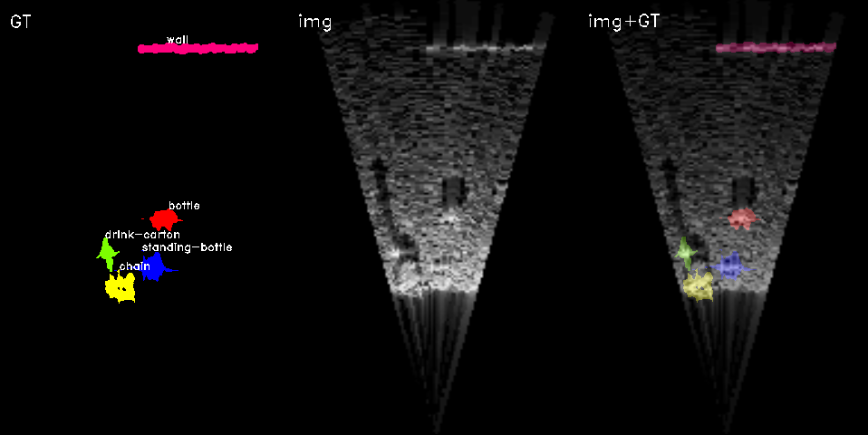

# 시뮬레이터를 이용한 수중 Multibeam Sonar Semantic segmentation
## 1. 과제 개요
### 가. 과제 선정 배경 및 필요성
바닷속은 아직 미지의 영역이며 변수가 많은 위험한 공간이다. 수압과 호흡의 문제 때문에 깊은 바다는 사람이 직접 잠수하여 접근하기 힘들다. 또 물속에서는 빛이 잘 전달되지 않아 무인잠수정(UUV)을 투입하여 깊은 곳으로 가더라도 지상에서처럼 카메라를 이용해 물체를 구분하기 어렵다. 이런 상황에서 사람이 직접 가기 힘든 곳에 무인잠수정을 투입하고 무인잠수정의 멀티빔 소나에서 수집하여 변환한 이미지로 수중 물체 탐지를 하면 더 안전하고 효과적으로 물체 탐지가 가능할 것으로 생각된다. 또한, 이를 활용하여 더 효율적인 인명 구조와 심해 탐사, 해양 쓰레기 탐지도 가능하리라 생각한다.

수중 환경은 접근이 힘들고 통제하기 어렵다. 특히 바다는 매우 넓고 깊으며 지형이 다양하며 다른 변수가 많으므로 통제하기 더 어렵다. 수중 환경을 탐색할 수 있는 무인잠수정과 소나의 가격도 비싸다. 그러므로 실제 바닷속에서 데이터를 얻는 것은 상당한 비용이 든다. 이런 상황에서 수중에서 소나를 이용해 얻은 데이터는 지상에서 카메라를 이용해 얻은 데이터에 비하면 데이터의 양과 질이 현저히 떨어진다. 따라서 시뮬레이터를 이용해 데이터를 수집하여 이를 보충한다면 데이터 수집 비용이 상당히 줄어들고 Semantic segmentation 모델의 성능 향상도 이루어질 것이라 기대된다.
### 나. 과제 주요내용
실제로 수중에서 얻은 데이터를 이용해 Semantic segmentation 모델을 학습하고 Multibeam 소나 시뮬레이터에서 얻은 데이터를 추가하여 모델을 학습하여 정확도를 비교한다. 시뮬레이터에서 데이터를 수집할 때 시뮬레이터 상에서의 물체의 위치와 상태를 바꾸어가면서 mask와 label(ground-truth)을 함께 얻도록 하여 별도의 annotation 작업이 필요 없도록 해 데이터 수집 비용을 줄일 수 있도록 한다. 이후 시뮬레이터에서 얻은 데이터와 실제 데이터를 이용해 Semantic segmentation의 정확도를 높일 방법을 찾는다.

## 2. 추진현황
### [가. Semantic segmentation 모델 구현](https://github.com/sundongpark/sonar_segmentation)
Semantic segmentation은 PyTorch를 이용해 구현한다. 선행연구(Singh, D., & Valdenegro-Toro, M. (2021).)에서 가장 성능이 좋았던 Unet+ResNet34 모델을 포함하여 Unet, Unet+ResNet(18, 34, 50, 101, 152), Unet+VGG(16, 19) 모델을 구축하였다. 이후 더 정확한 결과를 얻기 위해 구현한 모델에 가중치를 고정하여 학습을 진행해 mIoU 결과를 다시 얻었다.
### 나. 시뮬레이터 Sonar 이미지 조정
ARIS Explorer 3000 소나에서 수집된 데이터셋과 비슷한 이미지를 얻을 수 있도록 조정하였다. FOV와 주파수를 조정하여 ARIS Explorer 3000 소나와 비슷한 이미지를 얻을 수 있도록 조정하였다.
### 다. 시뮬레이터 Sonar 마스크 수집
Gazebo 시뮬레이터 상에서 바닥과 1~5개의 물체를 생성하여 소나 이미지를 얻는다. 이후 바닥을 제거하고 물체 하나씩만을 남겨 각각의 물체마다 투영된 이미지를 얻는다. 이때 노이즈를 제거하기 위해 물체마다 10장의 이미지를 수집한 뒤 평균을 구하고 일정 Threshold 이상의 값을 모두 Class의 ID로 칠하였다. 또 물체가 겹치는 부분과 그림자에 의해 가려지는 부분을 구분하기 위해 모든 물체가 있을 때 투영된 이미지와 비교하여 겹치는 부분만 남겨 마스크를 생성하였다. 이 과정을 반복하여 무한히 이미지와 마스크를 시뮬레이터에서 수집할 수 있다.

### 라. 시뮬레이터 소나 이미지 추가 후 Semantic segmentation 모델 성능 평가
시뮬레이터에서 얻은 Multibeam 소나 이미지를 기존 데이터셋(Marine Debris Datasets)에 0.2, 0.5, 1, 1.8배의 비율로 추가하여 성능을 평가하였다. 또 시뮬레이터에서 얻은 이미지만으로 학습한 이후 기존 데이터셋만을 사용하여 학습할 때, pre-trained 없이 학습할 때와 ImageNet pre-trained 모델을 사용할 때의 학습 속도를 비교하였다.

### 마. Depth camera를 이용해 소나 이미지 수집
ARIS Explorer 3000 소나와 비슷하게 Gazebo의 depth camera의 FOV를 조정하여 얻은 point cloud 정보를 이용해 ARIS Explorer 3000 소나와 비슷한 이미지를 얻도록 좌표 변환을 하여 이미지를 수집하였다.

## 3. 수행 결과
구축한 Unet, Unet+ResNet(18, 34, 50, 101, 152), Unet+VGG(16, 19) 모델의 가중치를 고정하여 학습을 진행해 mIoU 결과를 다시 얻은 결과는 다음과 같다.

## 3. 추진계획
### 가. 실험 및 성능 평가
시뮬레이터에서 생성한 데이터를 이용하여 다양한 조건에서 실험하고 성능을 평가하여 어떤 조건에서 가장 성능이 좋은지 분석한다. 또 어떤 요인이 성능을 향상시키는지 분석한다.

## Reference
* [Forward-Looking Sonar Marine Debris Datasets](https://github.com/mvaldenegro/marine-debris-fls-datasets)
* [Singh, Deepak, and Matias Valdenegro-Toro. "The marine debris dataset for forward-looking sonar semantic segmentation." Proceedings of the IEEE/CVF International Conference on Computer Vision. 2021.](https://openaccess.thecvf.com/content/ICCV2021W/OceanVision/html/Singh_The_Marine_Debris_Dataset_for_Forward-Looking_Sonar_Semantic_Segmentation_ICCVW_2021_paper.html)
* [DAVE](https://github.com/Field-Robotics-Lab/dave)
